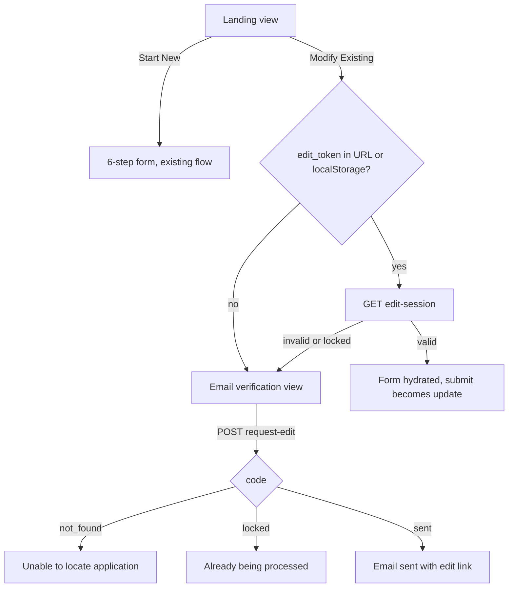

# Grant Application Self-Service Edit Flow

## Context (from research)

- Applications live in the `grant-application-final` collection; the public form POSTs to a custom route `POST /grant-application` ([apps/strapi/src/api/grant-application/controllers/grant-application.ts](apps/strapi/src/api/grant-application/controllers/grant-application.ts)) which upserts contacts and creates the record with status "New Application" (id 12).
- `status` is a relation to `grant-status` records — the check must be by name `"New Application"`, not a hardcoded id.
- The applicant's email is `point_of_contact` → `contact.email`.
- The frontend ([apps/grant-application](apps/grant-application)) is a 6-step react-hook-form wizard with localStorage draft persistence, file uploads to `/upload`, and PDF generation. No routing; views are toggled by context.
- Emails are sent via Brevo with `strapi.plugins["email"].services.email.send`; the `grant-management` plugin sends a receipt only on `afterCreate` (updates will not re-trigger it).
- No existing token/magic-link infrastructure — this will be new, but small.

## Backend (Strapi)

### 1. Token storage on the application

Add two private fields to [apps/strapi/src/api/grant-application-final/content-types/grant-application-final/schema.json](apps/strapi/src/api/grant-application-final/content-types/grant-application-final/schema.json):

- `edit_token` (string, `private: true`)
- `edit_token_expires` (datetime, `private: true`)

`private: true` keeps them out of all REST responses (member-manager, scoring, etc.).

### 2. Three new routes in `src/api/grant-application`

Added to [apps/strapi/src/api/grant-application/routes/grant-application.ts](apps/strapi/src/api/grant-application/routes/grant-application.ts), handlers in the existing controller:

**`POST /grant-application/request-edit`** — body `{ email }`

- Find the most recent `grant-application-final` where the email matches **any contact on the application** — `point_of_contact`, `chairman`, `engineer`, or `additional_contacts` (case-insensitive, `$or` filter) — populated with `status`. The edit link is emailed to the address that was entered.
- No match → `{ code: "not_found" }`
- Match but `status.name !== "New Application"` → `{ code: "locked" }`
- Match and status is "New Application" → reuse the existing unexpired `edit_token` or generate one (`crypto.randomBytes(32).toString("hex")`), set/extend `edit_token_expires` to +30 days, email the applicant a link `${GRANT_APP_URL}/?edit_token=...` via Brevo → `{ code: "sent" }`

**`GET /grant-application/edit-session?token=...`**

- Look up by `edit_token`; validate expiry AND that `status.name === "New Application"` (this is the re-check required after clicking the link).
- Valid → return the application populated with `point_of_contact`, `chairman`, `engineer`, `additional_contacts`, `grant`, `selected_projects`, and all media fields, mapped into the same shape as `IGrantApplicationFormPayload` so the frontend can hydrate directly.
- Invalid/expired → 404 `{ code: "invalid" }`; status moved on → 409 `{ code: "locked" }`

**`PUT /grant-application/edit-session`** — body `{ token, ...payload }`

- Re-validate token, expiry, and "New Application" status server-side (never trust the client).
- Upsert contacts the same way the create path does, coerce with the existing `coerceToSchema`, and `update` the `grant-application-final` (including replacing `applicant_pdf` and file relations). Status is not changed; no emails are sent (per your choice).
- Log the edit to `api::log.log` like the create path does.

### 3. Return the token on create

In `createGrantApplication`, generate `edit_token`/`edit_token_expires` at creation time and include the token in the success response, so the frontend can stash it in localStorage for the "come back a month later on the same device" path.

## Multiple contacts

The three fixed role relations (`point_of_contact`, `chairman`, `engineer`) stay as-is — the receipt email, award letter, and PDF logic all key off them. Extra people are a new list alongside them.

### 4. Schema: `additional_contacts`

Add to [apps/strapi/src/api/grant-application-final/content-types/grant-application-final/schema.json](apps/strapi/src/api/grant-application-final/content-types/grant-application-final/schema.json):

- `additional_contacts` — `oneToMany` relation to `api::contact.contact`, mirroring the existing `contacts` field on `watersystem` and `associate` (unidirectional, no `mappedBy`).

### 5. Backend: upsert additional contacts

In the create path of [apps/strapi/src/api/grant-application/controllers/grant-application.ts](apps/strapi/src/api/grant-application/controllers/grant-application.ts), and in the new `PUT /grant-application/edit-session` update path:

- Loop the payload's `additional_contacts` array through the existing `getContact` upsert (find by email, create contact + role-9 user if new) and assign the resulting IDs to the relation.
- On update, the relation array is replaced wholesale with what the form sends (removing a contact from the form detaches it from the application; the contact record itself is untouched).

### 6. Public form: "Additional Contacts" field array

In [apps/grant-application/src/components/SystemAndContactStep.tsx](apps/grant-application/src/components/SystemAndContactStep.tsx):

- Add an "Additional Contacts" block under the existing three contact slots using `ContactArray` in its already-built but unused `isArray={true}` mode ([apps/grant-application/src/components/ContactArrayInput.tsx](apps/grant-application/src/components/ContactArrayInput.tsx) — `useFieldArray` with Add/Remove Contact buttons). Same per-contact validation and "don't have an email" behavior apply.
- Add `additional_contacts: IContactPayload[]` to `IGrantApplicationFormPayload` in [apps/grant-application/src/types/types.ts](apps/grant-application/src/types/types.ts) and default it to `[]` in [apps/grant-application/src/helpers/defaultPayload.ts](apps/grant-application/src/helpers/defaultPayload.ts). Include them in the generated applicant PDF's contact section.
- The edit-session hydration (section 10 below) maps the populated relation back into this array.

### 7. member-manager: show and edit the list

In [apps/member-manager/src/modules/grant-manager](apps/member-manager/src/modules/grant-manager):

- `GrantApplicationDetails.tsx` — render `additional_contacts` as a list of contact links, same `Link to=/contacts/:id` pattern used for the three role contacts (populate it in the show query).
- `ApplicationFormFields.tsx` — add a `ReferenceArrayInput`/`AutocompleteArrayInput` on `additional_contacts`, matching the existing `point_of_contact`/`chairman` inputs; the existing `ContactsCreateModal` can be reused for creating a brand-new contact inline.
- Update the module's types (`GrantApplicationTypes.ts`).

The `grant-management` plugin needs no changes — [apps/strapi/src/plugins/grant-management/strapi-admin.js](apps/strapi/src/plugins/grant-management/strapi-admin.js) is a stub, and the server-side receipt email only uses `point_of_contact`.

## Frontend (apps/grant-application)

### 8. Entry mode selection

New landing view (following the existing context-toggled view pattern in [apps/grant-application/src/App.tsx](apps/grant-application/src/App.tsx)): "Start New Application" / "Modify Existing Application". Resolution order for the modify path:

1. `?edit_token=` query parameter (arriving from the email link — skips the landing screen entirely and goes straight to hydration)
2. `grant_application_edit_token` in localStorage
3. Otherwise, show the email verification view

### 9. Email verification view

Welcome blurb + email input + "Verify Email" button calling `request-edit`; renders the three messages from your spec based on the returned code.

### 10. Hydrate and edit

- On valid `edit-session`, reset the form (`methods.reset` in [apps/grant-application/src/FormProvider.tsx](apps/grant-application/src/FormProvider.tsx)) with the returned payload — same mechanism the admin entry-list restore already uses.
- Existing uploaded files arrive as `StrapiFormattedFile` entries with `src`/`title` and no `rawFile`; `processAndUploadFiles` will be taught to pass through already-uploaded files (keep their Strapi IDs) and only upload new `rawFile` entries.
- In edit mode, `StepNavigation.handleSubmitPayload` submits via `PUT /grant-application/edit-session` (with the token) instead of `POST /grant-application`; the PDF is regenerated and replaces the old `applicant_pdf`.
- If the session check comes back `locked` or `invalid`, clear the stored token and fall back to the email verification view with the appropriate message.
- On successful new-application submit, store the returned edit token in localStorage; edit-mode drafts skip or namespace the existing `grant_application_form_data` autosave key so a draft of someone else's new application isn't mixed in.

## Notes / decisions

- Per your answers: only the most recent "New Application" per email is editable, no emails are sent on edit, and any contact's email on the application (not just the point of contact) can request an edit link.
- The token is not single-use; the functional requirement (re-check on click) is satisfied by validating token + status on both session load and save. Once an admin moves the status past "New Application", every link and stored token immediately stops working.
- A new "Application Edit Link" `email-template` record will be used if present, with a sensible hardcoded fallback, matching the existing template pattern.
- The `GRANT_APP_URL` for building the email link comes from Strapi env config (new env var with a production default of the grant app's public URL — I'll confirm the deployed URL from `.env.production` during implementation).