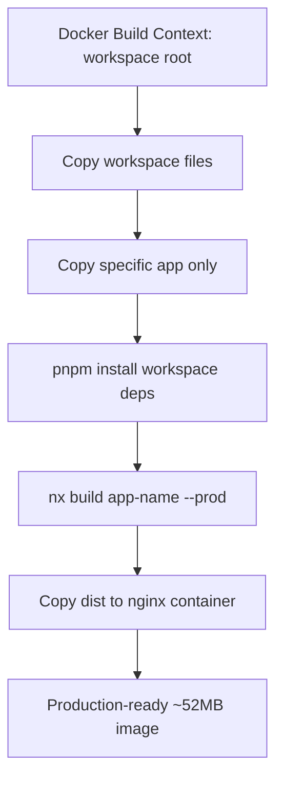
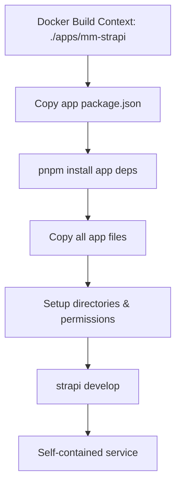

# ORWA Nx Monorepo Architecture Documentation

## 🏗️ **Architecture Overview**

This is an **Nx monorepo** containing multiple applications with optimized Docker containerization. The architecture follows **two distinct patterns** based on application type and requirements.

---

## 📁 **Project Structure**

```
orwa-monorepo/
├── package.json                    # 🎯 Workspace-wide dependencies
├── pnpm-lock.yaml                 # 🔒 Dependency lockfile
├── nx.json                        # ⚙️ Nx workspace configuration
├── tsconfig.base.json             # 📝 Shared TypeScript config
├── docker-compose.yml             # 🐳 Multi-service orchestration
├── Dockerfile.{app-name}          # 🐳 Monorepo-aware Dockerfiles
├── apps/
│   ├── grant-application/          # ⚛️ React/Vite app
│   ├── membership-application/     # ⚛️ React/Vite app  
│   ├── conference-registration/    # ⚛️ React/Vite app
│   ├── grant-map/                  # ⚛️ React/Vite app
│   ├── grant-scoring/              # ⚛️ React/Vite app
│   ├── associate-directory/        # ⚛️ React/Vite app
│   └── mm-strapi/                  # 🚀 Strapi CMS (standalone)
└── dist/                           # 📦 Build outputs
```

---

## 🏛️ **Architectural Patterns**

### **Pattern 1: Monorepo-Aware (React Applications)**

**Used for**: React/Vite frontend applications

**Characteristics**:
- ✅ **Build Context**: Workspace root (`.`)
- ✅ **Dockerfile**: `Dockerfile.{app-name}` at root level
- ✅ **Dependencies**: Managed at workspace root
- ✅ **Package.json**: Scripts only, no dependencies

**Benefits**:
- 🚀 **Faster builds**: Shared dependencies and build tools
- 💾 **Smaller images**: Only specific app code included
- 🔧 **Nx integration**: Full access to Nx build system
- ⚡ **Parallel builds**: Independent app builds

**Example Structure**:
```dockerfile
# Dockerfile.grant-application
FROM node:18-alpine as build
WORKDIR /workspace

# Copy workspace files
COPY package*.json ./
COPY pnpm-lock.yaml ./
COPY nx.json ./
COPY tsconfig.base.json ./

# Copy only specific app
COPY apps/grant-application ./apps/grant-application/

# Install workspace dependencies
RUN pnpm install --frozen-lockfile

# Build with Nx
RUN npx nx build grant-application --prod

# Production stage with nginx
FROM nginx:alpine
COPY --from=build /workspace/dist/apps/grant-application /usr/share/nginx/html
```

**App Package.json**:
```json
{
  "name": "grant-application",
  "scripts": {
    "build": "../../node_modules/.bin/vite build",
    "dev": "../../node_modules/.bin/vite",
    "preview": "../../node_modules/.bin/vite preview"
  }
}
```

### **Pattern 2: Standalone (Backend Services)**

**Used for**: Strapi CMS and other complex backend services

**Characteristics**:
- ✅ **Build Context**: App directory (`./apps/mm-strapi`)
- ✅ **Dockerfile**: `Dockerfile` within app directory
- ✅ **Dependencies**: Self-contained in app's package.json
- ✅ **Isolation**: Complete independence from monorepo complexity

**Benefits**:
- 🎯 **Simplicity**: No path resolution issues
- 🔒 **Isolation**: Self-contained and portable
- 🛠️ **Framework compatibility**: Works with framework expectations
- 📦 **Standard deployment**: Can be deployed independently

**Example Structure**:
```dockerfile
# apps/mm-strapi/Dockerfile
FROM node:18-alpine
WORKDIR /app

# Install dependencies
COPY package*.json ./
RUN pnpm install --frozen-lockfile

# Copy application
COPY . .

# Setup and start
RUN mkdir -p public/uploads
CMD ["pnpm", "run", "develop"]
```

**App Package.json**:
```json
{
  "name": "mm-strapi",
  "dependencies": {
    "@strapi/strapi": "5.22.0",
    "mysql2": "^3.14.3",
    // ... all required dependencies
  },
  "scripts": {
    "develop": "strapi develop",
    "start": "strapi start",
    "build": "strapi build"
  }
}
```

---

## 🎯 **Service Definitions**

### **Frontend Applications (Pattern 1)**
| Service | Port | Type | Build Pattern |
|---------|------|------|---------------|
| grant-application | 4200 | React/Vite | Monorepo-Aware |
| membership-application | 4201 | React/Vite | Monorepo-Aware |
| conference-registration | 4202 | React/Vite | Monorepo-Aware |
| grant-map | 4203 | React/Vite | Monorepo-Aware |
| grant-scoring | 4204 | React/Vite | Monorepo-Aware |
| associate-directory | 4205 | React/Vite | Monorepo-Aware |

### **Backend Services (Pattern 2)**
| Service | Port | Type | Build Pattern |
|---------|------|------|---------------|
| mm-strapi | 1337 | Strapi 5.x CMS | Standalone |
| mysql | 3306 | Database | External Image |

---

## 🔧 **Dependency Management**

### **Workspace Root (`package.json`)**
```json
{
  "dependencies": {
    "react": "19.0.0",
    "react-dom": "19.0.0", 
    "@strapi/strapi": "^5.22.0",
    // ... all shared dependencies
  },
  "devDependencies": {
    "@nx/react": "21.4.0",
    "@nx/vite": "21.4.0",
    "vite": "^6.0.0",
    "typescript": "~5.8.2",
    // ... all build tools
  }
}
```

### **React Apps (`apps/{app}/package.json`)**
```json
{
  "name": "{app-name}",
  "scripts": {
    "build": "../../node_modules/.bin/vite build",
    "dev": "../../node_modules/.bin/vite",
    "preview": "../../node_modules/.bin/vite preview"
  }
  // NO dependencies - managed at workspace root
}
```

### **Strapi App (`apps/mm-strapi/package.json`)**
```json
{
  "name": "mm-strapi",
  "dependencies": {
    "@strapi/strapi": "5.22.0",
    "mysql2": "^3.14.3",
    // ... all Strapi-specific dependencies
  },
  "scripts": {
    "develop": "strapi ts:generate-types && strapi develop",
    "start": "strapi start",
    "build": "strapi build"
  }
}
```

---

## 🐳 **Docker Configuration**

### **Docker Compose Structure**
```yaml
services:
  # Pattern 1: Monorepo-Aware (React Apps)
  grant-application:
    build:
      context: .                    # 🎯 Workspace root
      dockerfile: Dockerfile.grant-application
    ports: ["4200:80"]

  # Pattern 2: Standalone (Backend Services)  
  mm-strapi:
    build:
      context: ./apps/mm-strapi    # 🎯 App directory
      dockerfile: Dockerfile
    ports: ["1337:1337"]
```

### **Build Context Comparison**

| Pattern | Context | Copies | Dependencies | Use Case |
|---------|---------|---------|--------------|----------|
| **Monorepo-Aware** | `.` (workspace root) | Workspace + specific app | Workspace-managed | React/Frontend |
| **Standalone** | `./apps/{app}` | App directory only | App-managed | Backend/Complex services |

---

## 🎛️ **Development Workflows**

### **Available Commands**
```bash
# Development
npm run dev                 # Start all services with docker-compose
npm run dev:detached       # Start in background
npm run dev:stop           # Stop all services

# Individual services (local development)
npm run start:strapi       # nx serve mm-strapi
npm run start:grant-app    # nx serve grant-application
npm run start:membership   # nx serve membership-application

# Testing & Building
npm run test              # Run all tests
npm run build             # Build all apps
npm run build:docker      # Build Docker images only
```

### **Service URLs (Development)**
- **Strapi Admin**: http://localhost:1337/admin
- **Strapi API**: http://localhost:1337/api
- **Grant Application**: http://localhost:4200
- **Membership Application**: http://localhost:4201
- **Conference Registration**: http://localhost:4202
- **Grant Map**: http://localhost:4203
- **Grant Scoring**: http://localhost:4204
- **Associate Directory**: http://localhost:4205

---

## 🔄 **Build Process Flow**

### **React Apps (Pattern 1)**


### **Strapi (Pattern 2)**


---

## 🎯 **Key Design Decisions**

### **Why Two Patterns?**

1. **React Apps**: 
   - Benefit from shared build tools (Vite, TypeScript, etc.)
   - Simple applications with no interdependencies
   - Compile to static files (nginx serving)
   - Optimal for monorepo sharing

2. **Strapi CMS**:
   - Complex framework with specific directory expectations
   - TypeScript configuration requirements
   - Runtime service (not static files)
   - Better as standalone for simplicity

### **Dependency Strategy**
- **Workspace Root**: Build tools, shared libraries, framework packages
- **React Apps**: No dependencies (inherit from workspace)
- **Strapi**: Full dependency list (self-contained)

### **Performance Optimizations**
- **Build Context Size**: React apps ~55KB, Strapi ~77MB (appropriate for each)
- **Image Size**: React apps ~52MB, Strapi ~2.5GB (framework differences)
- **Build Speed**: Parallel builds, cached layers, minimal contexts

---

## 🚀 **Migration Summary (Strapi 4.x → 5.x)**

### **Migrated Components**
- ✅ **68 Content Types**: All API entities migrated
- ✅ **Configuration**: Database, email, middleware, cron tasks
- ✅ **Custom Plugins**: Activity feed, grant management
- ✅ **Email System**: Brevo provider, templates, scheduling
- ✅ **TypeScript**: Full type generation and compilation

### **Breaking Changes Handled**
- 📦 **Package versions**: @strapi/strapi 4.19.0 → 5.22.0
- 🗄️ **Database client**: mysql → mysql2
- ⚛️ **React compatibility**: 18.x maintained (v5 requirement)
- 🔧 **Configuration format**: CommonJS maintained for compatibility

---

## 📋 **AI Agent Context Guidelines**

### **When Working on This Project**

1. **Identify Service Type**:
   - **React/Frontend**: Use Pattern 1 (Monorepo-Aware)
   - **Backend/Complex**: Use Pattern 2 (Standalone)

2. **Package.json Rules**:
   - **React apps**: Scripts only, NO dependencies
   - **Backend services**: Full dependencies + scripts
   - **Workspace root**: ALL shared dependencies

3. **Docker Context**:
   - **React**: Build from workspace root
   - **Backend**: Build from app directory

4. **Path Resolution**:
   - **Monorepo-Aware**: `../../node_modules/.bin/{tool}`
   - **Standalone**: Direct tool names (`vite`, `strapi`)

### **Common Pitfalls to Avoid**
- ❌ Don't mix dependency management patterns
- ❌ Don't use workspace paths in standalone containers
- ❌ Don't copy entire apps/ directory for single-app builds
- ❌ Don't remove package.json scripts (Nx needs them)

### **Architecture Validation Checklist**
- [ ] Dependencies match the chosen pattern
- [ ] Docker context matches package.json script assumptions  
- [ ] Build commands work in the target execution environment
- [ ] TypeScript paths resolve correctly in containers
- [ ] Services can communicate via docker network

---

## 🎯 **Success Metrics**

### **Current Status** ✅
- **All React Apps**: Building and running (~52MB images)
- **Strapi CMS**: Migrated to v5.x with 68 content types
- **Database**: MySQL 8.x connected and operational
- **Email System**: Brevo provider configured with cron scheduling
- **Development**: Full stack runs with `npm run dev`

### **Performance Benchmarks**
- **React Build Time**: ~20 seconds per app
- **Strapi Build Time**: ~2-3 minutes (acceptable for backend)
- **Total Stack Startup**: ~5 minutes (cold start)
- **Memory Usage**: ~4GB total (all services)

---

## 🔮 **Future Considerations**

### **Scaling Strategies**
1. **Add shared libraries**: Use `libs/` directory for common React components
2. **Microservices**: Additional backend services can use Pattern 2
3. **CI/CD**: Each pattern supports independent deployment pipelines
4. **Monitoring**: Add health checks and logging services

### **Technology Upgrades**
- **React 19**: Already implemented (with Strapi compatibility notes)
- **Node.js 20**: Planned upgrade path available
- **Strapi 6.x**: Migration path documented for future

---

## 🤖 **AI Agent Instructions**

When modifying this project:

1. **Always check the service type** before making changes
2. **Verify package.json usage** in the specific context (Docker vs local)
3. **Test path resolution** before assuming file locations
4. **Follow the established patterns** rather than creating new ones
5. **Consider both local development AND Docker contexts**

**This architecture documentation should be referenced before making any structural changes to ensure consistency and prevent architectural drift.**

---

*Last Updated: September 2025*  
*Architecture Pattern: Hybrid Nx Monorepo (Dual-Pattern)*  
*Status: Production Ready* ✅
